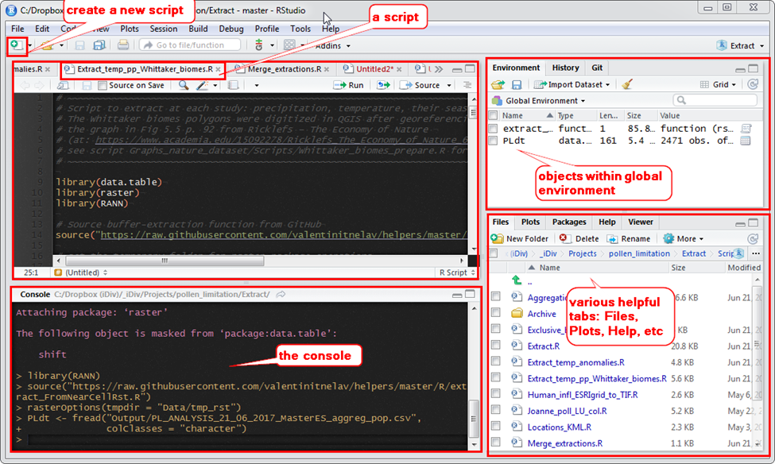
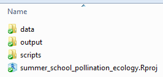
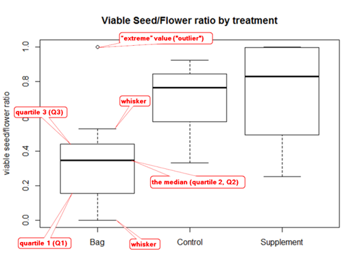

## Goals for this lab

- The built-in **help** system of R
- R **objects**
- read your csv as **data frame**
- data frames - structure, indexing
- graphs: make a **boxplot**

## R & RStudio - 1 {.flexbox .vcenter}

R Studio was designed to offer a friendlier user interface to R.
In the picture below, the terminology that is used in this computer lab is shown.

```{r, echo=FALSE, out.width="80%", fig.align='center'}

```

## R & RStudio - 2

Is good practice to keep **data separated from output and scripts**. This helps others adapt fast to your project.

```{r, echo=FALSE, out.width="50%", fig.align='center'}

```


## The built-in help system of R

```{r eval=FALSE}
help.start()          # general help
help(read.table)      # help about function `read.table`
?read.table           # same as above
?"[["                 # help for special characters (note the use of double quotation marks)
?'[['                 # same as above, using simple quotation marks
?`[[`                 # or this
?"%in%"               # help for function %in%
apropos("data.frame") # list all functions containing the string "data.frame"
example(data.frame)   # show an example of function data.frame
```

For the followings, you need internet connection.
```{r eval=FALSE}
RSiteSearch("bipartite") # search for key words or phrases in documentation; you need internet connection
# install.packages("sos")          # to install a package
# library(sos) # or library("sos") # to load/attach a package
sos::findFn("bipartite")
```

Note how the symbol `#` marks a comment.

Note also how you can call a function from a certain package using `::` in `sos::findFn("bipartite")`.

Try to run some of the examples in the console.


## The built-in help system of R - vignettes

Vignettes are documents authors of packages write to explain how to use the package (intros) and often provide case studies. To get information if a package has available vignettes, you can try:

```{r eval=FALSE}
browseVignettes("vegan") # you need internet connection
```

Can also search a package by name on the [Comprehensive R Archive Network (CRAN)](https://cran.r-project.org/web/packages/available_packages_by_name.html). Its CRAN web page may contain vignettes and other useful information.

Other packages may not be on CRAN, but you could find them on [GitHub](https://github.com/).


## Arithmetic & Relational Operators

```{r, eval=FALSE}
0.3 + 0.6   # addition
.3 + .6     # same as above
0.9 - 0.3   # subtraction
2 * 3       # multiplication
0.9 / 0.3   # division
5 %% 3      # remainder of the division (modulus divison)
5 %/% 3     # integer division
3 ^ 3       # exponentiation
3 ** 3      # same as 3^3
```

Relational Operators: `<, >, <=, >=, ==, !=`

To get detailed help try for example `?"+"` or `?">"` in the console.


## The Floating Point Trap

```{r}
.1 == .3 / 3
.3 / 3
print(.3 / 3, digits = 22)
# A solution
.1 == round(.3 / 3, digits = 1)
```

## R objects

R operates on named data types/structures/objects.

There are five objects most often used in data analysis :

|Dimensions | Homogeneous | Heterogeneous|
|-----------|-------------|--------------|
|1D         |Atomic vector| List|
|2D         |Matrix       |Data frame |
|nD         |Array        ||

**Homogenous** - contain only one type of data (e.g. only numeric).

**Heterogeneous** - can contain various types of data (e.g. a data frame can have numeric and character columns).

We will discuss only **Atomic vectors** and **Data frames**.

## R objects - naming conventions

- Names of variables can be chosen quite freely in R. They can include letters, digits, underscores, and the period (dot) symbol. There is, however, the limitation that **the name must NOT start with a digit or a period followed by a digit**. e.g: `2this` or `.2this` but `.this_is_ok` (hidden object);
- **Names are case-sensitive** (`my_vector` is thus different from `My_vector`).
- Some names are reserved for use by R. They cause confusion and should be avoided. Some examples: **c, q ,t, C, D, F, I, T, df, pt, qt, rt**, etc. In practice, you should avoid these and should have names a bit longer than just one or two letters (**longer names can be helpful** actually).

## Atomic vectors - double/numeric

Four common types of atomic vectors: 

- **double** (or **numeric**)
- **integer**
- **logical**
- **character**

They can contain only one type of data - a vector cannot contain both numeric and character data.

```{r}
double_vector <- c(1, 2.5, 4.5)
# transform a numeric vector into an integer vector
integer_vector <- as.integer(double_vector)
logical_vector <- c(TRUE, FALSE, T, F) # better avoid T and F
character_vector <- c("my string", "your string")
```

## Atomic vectors - vectorization

The same arithmetic and relational operators presented previously can be applied on vectors as we applied them on single values.

```{r}
double_vector
double_vector + 10 # adds 10 to each element of the vector ("vectorization")
```

## Data frames

Tabular (rectangular) data sets with columns as variables and rows as observations are stored in R as **data frames**. 

The columns can be of any type described above and also lists. 

## Read csv as data.frame

To get your table from Excel into R, you first need to save it as CSV file (Alternatively, there are also special packages to read directly from Excel like `readxl`, `gdata`, `xlsx`).

All familiar with Excel to CSV?

Read csv file as data frame using read.table function:
```{r, eval=FALSE}
Carduus_data <- read.table(file   = "data/Carduus_data.csv", 
                           header = TRUE, 
                           sep    = ",", 
                           strip.white = TRUE)
# We have used the function read.table, which has several arguments 
# for which you can find details if you run the command ?read.table or help(read.table)
?read.table
```

Read csv file as data frame using read.csv function:
```{r, eval=FALSE}
# This does the same thing as read.table function
Carduus_data <- read.csv(file   = "data/Carduus_data.csv", 
                         header = TRUE,
                         strip.white = TRUE)
```

```{r, echo=FALSE}
Carduus_data <- read.csv(file   = "../data/Carduus_data.csv", 
                         header = TRUE,
                         strip.white = TRUE)
```


## Data frames - structure

To inspect the structure of the data frame, use
```{r}
str(Carduus_data)
```
It tells you that there are 7 variables (columns) and 25 observations (rows). 
Also gives some information about the type of each variable (column).


## Data frames - view content

You can also visualize the data frame with:
```{r, eval=FALSE}
View(Carduus_data)
```

You can also inspect the content of your data frame by simply calling its name `Carduus_data`. Its content will be displayed in console. For big data frames this is not recommended. In such cases you are better off with just having a look at the first and last few rows:
```{r}
head(Carduus_data)    # display in console by default the first 6 rows
```
```{r, eval=FALSE}
tail(Carduus_data)    # display in console by default the last 6 rows
```


## Data frames - indexing

Notice the indexing of the data frame:
```{r, eval=FALSE}
Carduus_data[1:2,5]    # selects rows 1 to 2 from column 5
Carduus_data[1:2,]     # selects rows 1 to 2 from all columns
Carduus_data[,1:2]     # selects columns 1 to 2
Carduus_data[,1]       # selects only column 1 (select column by index)
Carduus_data$Plant     # does the same thing as above (select column by name)
Carduus_data[,"Plant"] # same as above; returns a vector
```

**The one column to vector trap**
```{r, eval=FALSE}
Carduus_data[,"Plant", drop=FALSE] # same as above, but returns a data.frame and not a vector 
```

You do not have to use `drop=FALSE` if you index for more than one column as you saw above already:
```{r, eval=FALSE}
Carduus_data[,1:2] # selects columns 1 to 2, returns a data.frame
```


## Data frames - column operations

Column `Ratio` is the ration between viable seeds and total number of seeds:
```{r}
Carduus_data$Ratio2 <- Carduus_data$Viable.Seeds / Carduus_data$Total
```

Was the operation successful?
```{r}
str(Carduus_data)
all.equal(Carduus_data$Ratio, Carduus_data$Ratio2)
```


## The `summary()` function - 1

The summary function summarizes each variable according to its class.
```{r}
summary(Carduus_data)
```

## The `summary()` function - 2

`str` and `summary` functions are recommended for routine use.

You can see in the summary output that some statistics are computed for each column. Each one of these stats can be computed in R with a specific function separately if needed:
```{r, eval=FALSE}
min(Carduus_data$Diameter) # gives an NA because NA values are present within the variable
min(Carduus_data$Diameter, na.rm = TRUE) # use option na.rm = TRUE to omit NA-s
max(Carduus_data$Diameter, na.rm = TRUE)
median(Carduus_data$Diameter, na.rm = TRUE)
quantile(Carduus_data$Diameter, na.rm = TRUE)
```

Summary can also be applied on a column / vector only
```{r}
summary(Carduus_data$Diameter)
```


## Dealing with NA-s

- One way of dealing with NA-s was used already above: the option `na.rm = TRUE`.

- Use `is.na()` to get a logical vector and use it further to index your data.frame:

```{r, eval=FALSE}
diam.is.na <- is.na(Carduus_data$Diameter) # which rows are NA in variable Diameter?
diam.is.na # this is a logical vector
Carduus_data[diam.is.na,]  # show all observations that have an NA for Diameter variable
Carduus_data[!diam.is.na,] # show all observations that contain no NA in Diameter variable
```

- A very conservative approach to dealing with NA-s is to eliminate any row that contains at least one NA in one of the columns. This can be achieved with the function `complete.cases()`.
```{r, eval=FALSE}
Carduus_data[complete.cases(Carduus_data),]  # eliminate all rows containing at least one NA
Carduus_data[!complete.cases(Carduus_data),] # the inverse of the above operation
```

## Boxplot - 1

boxplot = "box-and-whiskers plot"

Widely used visual tool to check if there are differences among our grouped observations. For a single group of observations it acts as a visual summary of the distribution of those observations.

```{r, out.width="40%", fig.align='center'}
boxplot(Ratio ~ Treatment,
        data = Carduus_data,
        main = "Viable Seeds/Flower ratio by treatment",
        ylab = "Viable seeds/flower ratio")
```

Check `?boxplot.stats` for more details.


## Boxplot - 2

```{r, echo=FALSE, out.width="50%", fig.align='center'}

```

Our boxplot indicates already that there could be statistically significant differences in the viable seed per flower ratio between treatment level "Bag" and the other two levels "Control" and "Supplement". 

We will test for statistical differences next in our ANOVA lab.
